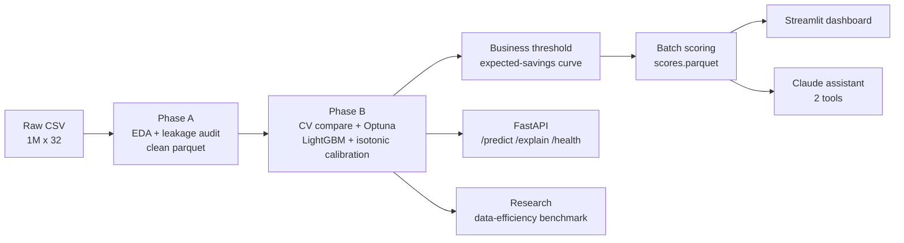

# ChurnIQ — End-to-End Churn Prediction on 1M Customers

Predicts customer churn on a 1M-row synthetic telco dataset and turns the
predictions into a retention campaign: leakage-audited EDA → calibrated
LightGBM → business-threshold optimization → FastAPI serving → dashboard →
LLM analyst assistant.

## Architecture



## Results

| metric (20% holdout, untouched) | value | context |
|---|---|---|
| ROC-AUC | 0.685 | 0.5 = random |
| PR-AUC | 0.201 | base rate 0.099 = random (2.0× lift) |
| Brier | 0.0852 | churn-rate-only predictor ≈ 0.0894 |
| Business threshold | 0.17 | targets 10.4% of base, ≈ $500k expected savings / 200k customers |
| Top-decile lift | 2.47× | top predicted-risk decile churns at 24.5% |

This is a deliberately **weak-signal dataset** (best single-feature AUC 0.576;
demographics carry nothing) — the project's value is the *process*: a full-1M
leakage audit with recorded verdicts, calibration before thresholding, and a
threshold picked by expected campaign savings instead of accuracy.

Key artifacts: [`reports/eda_findings.md`](reports/eda_findings.md) ·
[`reports/model_card.md`](reports/model_card.md) ·
[`research/benchmark_report.md`](research/benchmark_report.md)

## Quickstart

```bash
python -m venv .venv && .venv/Scripts/activate   # Windows
pip install -e ".[dev]"

# Phase A: notebooks/01_phase_a_data_foundation.ipynb produces the clean parquet
python -m churniq.train            # train + calibrate + pick threshold (~minutes)
python -m churniq.batch_score      # score all 1M customers
uvicorn churniq.api:app            # serve /predict /explain /health
streamlit run app/dashboard.py     # executive + model dashboards
python app/assistant.py "which contract type is riskiest?"   # needs ANTHROPIC_API_KEY
pytest                             # self-contained tests (synthetic data)
```

The raw dataset (`data/`) is not committed. Docker: `docker compose up --build`
(after training, since the image copies `models/`).

## Design decisions worth asking me about

- **Why fit preprocessing inside CV folds** — imputer medians/one-hot vocab
  learned on the full data leak test-set statistics into training.
- **Why no `scale_pos_weight`** — class reweighting distorts probabilities;
  the business threshold needs calibrated probabilities more than a
  balanced-looking 0.5 cut. Isotonic calibration on a held-out slice instead.
- **Why the threshold isn't 0.5** — it maximizes
  `save_rate x CLV x (churners caught) − offer_cost x (targeted)` on the
  holdout; a missed churner costs ~16x an offer.
- **Why LEAKAGE_COLS is empty** — audited on the full 1M, not assumed: all
  four suspects show pre-churn statistical signatures (see EDA findings).
- **Why LightGBM over TabPFN** — decision record in the research benchmark:
  CPU-only 1M-row serving constraint vs TabPFN's ≤10k-row GPU regime.

## Project structure

```
src/churniq/        package: config, data, pipeline, train, evaluate,
                    explain (native TreeSHAP), batch_score, api (FastAPI)
notebooks/          Phase A data foundation (EDA, leakage audit)
research/           data-efficiency benchmark (Phase C)
app/                Streamlit dashboard + Claude assistant (Phase E)
tests/              self-contained pytest suite (runs in CI without data)
reports/            EDA findings, model card, metrics, figures
```

## Honest scope notes

- Power BI dashboards from the original plan are replaced by Streamlit
  (reproducible in-repo); a star-schema export for BI tools is future work.
- MLflow tracking replaced by versioned `reports/metrics.json` — right-sized
  for a single-model project.
- Validation on a second dataset (BCG energy churn) is future work.
