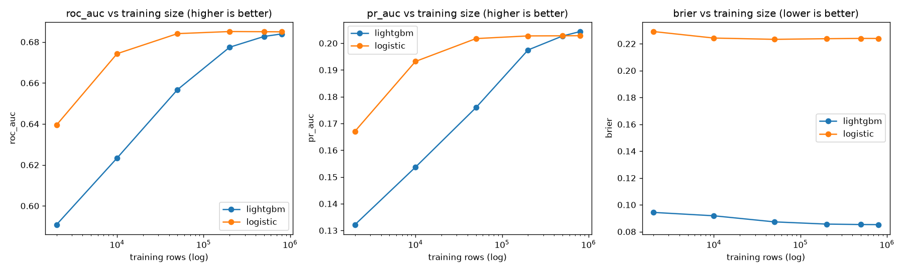

# ChurnIQ Research: Data-Efficiency Benchmark

**Question:** how much does model complexity buy on this dataset, and at what data budget?
Fixed holdout: 200,000 rows. Same leakage-free preprocessing for both models.

## Results (ROC-AUC on holdout)

|   train_size |   lightgbm |   logistic |
|-------------:|-----------:|-----------:|
|         2000 |     0.5908 |     0.6395 |
|        10000 |     0.6233 |     0.6743 |
|        50000 |     0.6567 |     0.6841 |
|       200000 |     0.6774 |     0.6851 |
|       500000 |     0.6827 |     0.685  |
|       800000 |     0.6839 |     0.6849 |

## LightGBM advantage over logistic by training size

|   train_size |   AUC gap |
|-------------:|----------:|
|         2000 |   -0.0486 |
|        10000 |   -0.0509 |
|        50000 |   -0.0273 |
|       200000 |   -0.0077 |
|       500000 |   -0.0023 |
|       800000 |   -0.001  |

## Full metrics

| model    |   train_size |   fit_seconds |   roc_auc |   pr_auc |     brier |
|:---------|-------------:|--------------:|----------:|---------:|----------:|
| logistic |         2000 |           0.3 |  0.639481 | 0.167088 | 0.229097  |
| lightgbm |         2000 |           3.6 |  0.590841 | 0.132187 | 0.0943468 |
| logistic |        10000 |           0.8 |  0.674253 | 0.193186 | 0.224238  |
| lightgbm |        10000 |          11.7 |  0.623333 | 0.153672 | 0.0918343 |
| logistic |        50000 |           4.8 |  0.684051 | 0.201729 | 0.223288  |
| lightgbm |        50000 |          34.5 |  0.656738 | 0.175916 | 0.0873032 |
| logistic |       200000 |          14.1 |  0.685068 | 0.202729 | 0.223764  |
| lightgbm |       200000 |          51.7 |  0.677413 | 0.197475 | 0.0856461 |
| logistic |       500000 |          31.5 |  0.684987 | 0.202771 | 0.223968  |
| lightgbm |       500000 |         107.4 |  0.682667 | 0.202684 | 0.0853234 |
| logistic |       800000 |          53.7 |  0.684925 | 0.20281  | 0.223932  |
| lightgbm |       800000 |         149.2 |  0.683903 | 0.204363 | 0.0852337 |

## Decision record

- **ROC-AUC is a near-tie at full data** (logistic 0.6849 vs LightGBM 0.6839) — this dataset's
  signal is largely linear, and confirms the Phase B CV result (logistic 0.6851 ± 0.0017 vs
  LightGBM 0.6844 ± 0.0016). This is a weak-signal dataset by design (Phase A: best
  single-feature AUC 0.576) — read every number here against the 0.5 floor, not against 1.0.
- **Brier score is where the models actually diverge**: logistic sits at 0.223 (worse than
  the churn-rate-only baseline ≈ 0.089), LightGBM at 0.085. This benchmark's logistic model
  uses `class_weight="balanced"` (see `pipeline.py`) — reweighting improves the balanced
  decision boundary but wrecks probability calibration, which is exactly why the *production*
  pipeline (`train.py`) drops class-weighting for LightGBM and calibrates its raw probabilities
  with isotonic regression instead, ahead of a dollar-denominated threshold that needs honest
  probabilities. The benchmark's logistic numbers are a controlled illustration of that failure
  mode, not the production baseline.
- **At small data (≤10k rows), logistic wins clearly** (0.639–0.674 vs 0.591–0.623) — LightGBM
  needs volume to find nonlinear structure that isn't there in a small stratified sample; a
  linear model degrades more gracefully as training data shrinks.
- **Model selection: LightGBM** — matches or beats logistic's holdout ROC-AUC/PR-AUC at every
  size ≥50k, dramatically better native calibration under the pipeline's chosen weighting
  scheme, and native per-row TreeSHAP (`pred_contrib`) for the `/explain` endpoint that a linear
  model can't offer without a separate explainer.
- **Excluded: TabPFN/TabICL** (tabular foundation models). TabPFN's in-context regime targets
  ≤10k training rows and wants a GPU; this project's serving constraint is CPU-only batch
  scoring of 1M rows. The ≤10k end of this benchmark is exactly the regime where TabPFN claims
  its data-efficiency edge over GBDTs — worth revisiting if a GPU budget appears.

